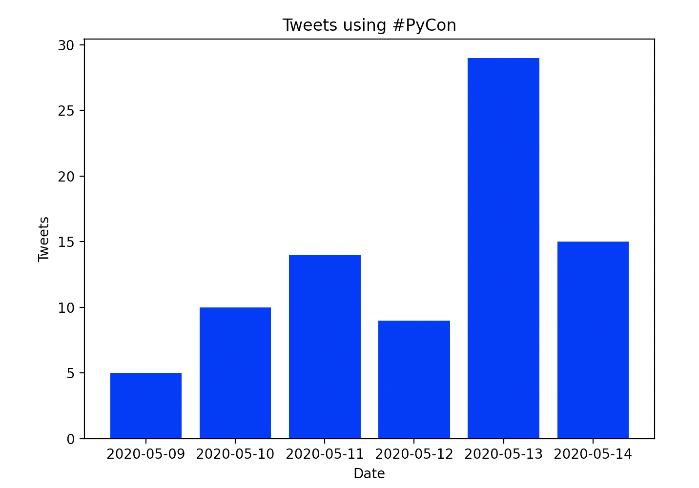
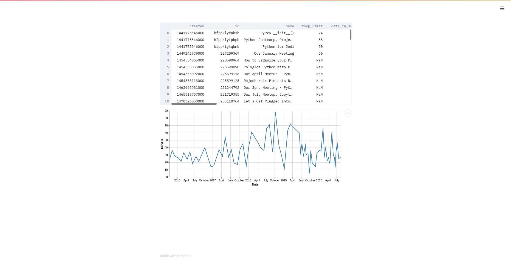
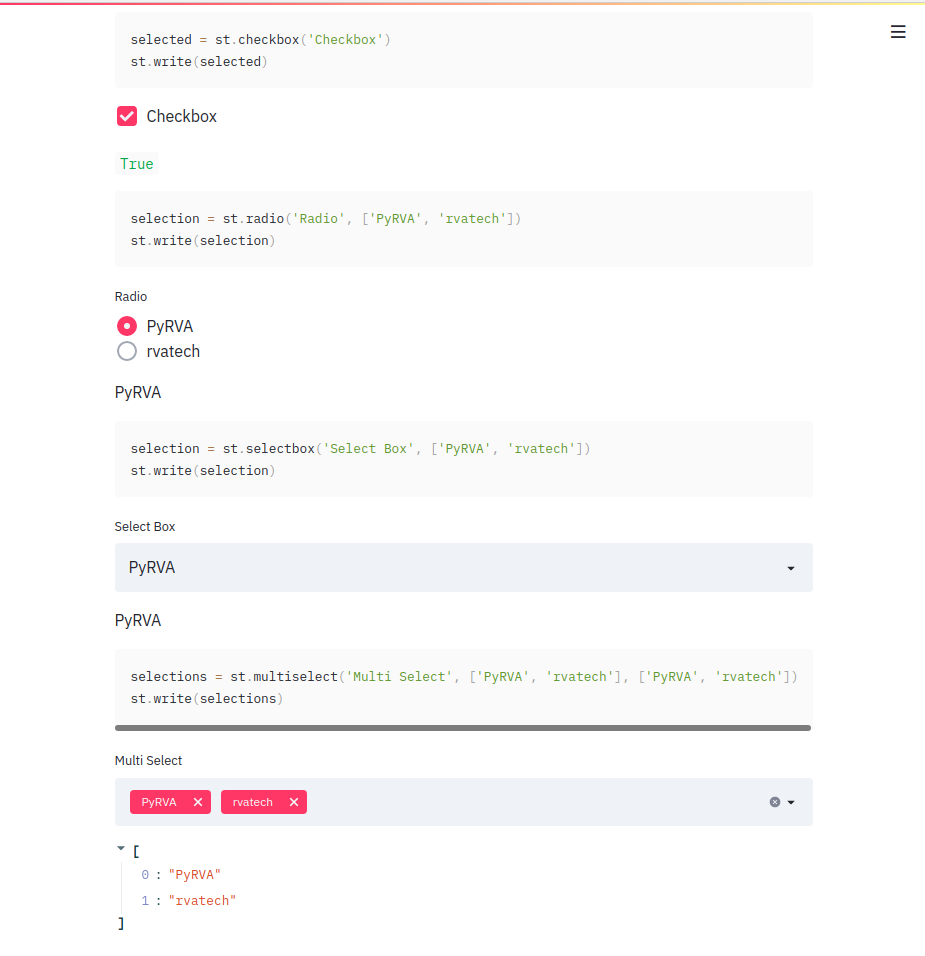
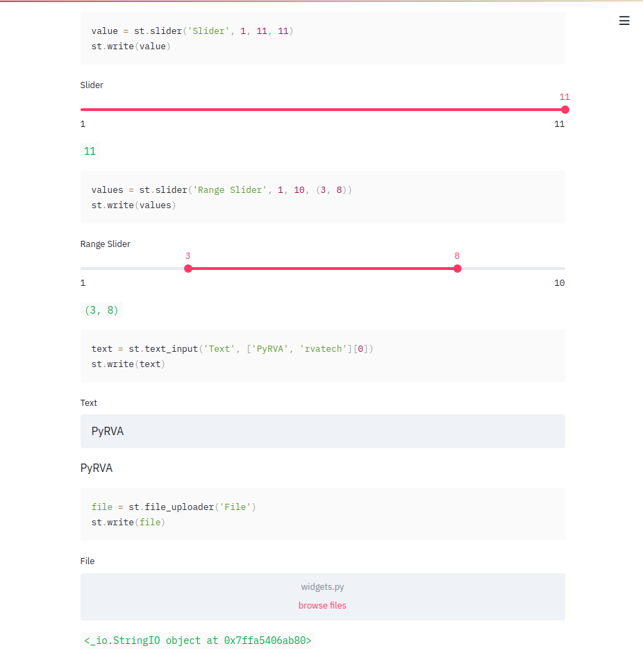

class: title

# Python the Swiss Army Knife:
## Sourcing, Analyzing, and Reporting Twitter Data Using Python


---

class: title

# Some bullet points

???

Python is a unique language. It is powerful enough to used in places like NASA, Wall Street, and the Large Hadron Collider to do things like render the first image of a black hole and discover new particles.

Yet it's syntax is simple enough that it is used in elementary schools to teach students to program.

This imbalance of readability and power is one aspect that is contributing to python's rise in popularity. But how can that be, after all, Python is not as fast as C. It is not in all the same environments that JavaScript is in. It's too big to fit on board most embedded chips.

And yet it beat out C developers in creating an online platform (YouTube). People are bringing it to the browser it's getting put on development boards (Circuit Playground Express).

---

class: title

# Why is this?

---

class: title

> Python is not the best language at doing any one thing. 
> But the moment you want to do more than one thing, Python quickly rises to the top.

<cite>~ Glyph Lefkowitz</cite>

---

class: title

The python ecosystem is large, and it gives anyone the ability to download software that can empower your project
to capture data, analyze and graph it, and deploy it to a web server, without having to change languages.

It is this attribute of python that we'd like to show you today.

---

# We're going to show you how to accomplish several different tasks, all from within python

--
* Get data from Twitter

--
* Produce a simple bar chart

--
* Use Streamlit to produce charts and graphics

--
* Use Podium to produce these slides

---

class: logo

# Presenters:

| | |
|---|---|
|  | Stephen Lowery |
|  | Brian Cohan |
|  | Mike Alfare |

---

class: class

# Save Twitter data (by hand)

Say we wanted to use python to visualize how many tweets a day are using a certain hashtag.

We can visit twitter and copy all the tweets we find, along with the day they were tweeted and save to a file that looks like this:

```
2020-05-09,Wow #PyRVA is super cool!
2020-05-09,Wow #PyRVA is super duper cool!
2020-05-10,Wow #PyRVA is super awesome!
```

This type of file is known as a csv (or comma-separated values) file, and python comes with a library for working with them: `csv`

---

class: title

# Read Twitter data from a file

Now that we have some data, let's pull it into python using `csv`:

``` python
import csv
from pathlib import Path

def get_data():
    """ get the data from csv """
    # Find tweets in file next to this one
    base_path = Path(__file__)
    data_path = base_path.parent / "tweets.csv"
    # Open file & read content
    with data_path.open() as f:
        reader = csv.DictReader(f, ["date", "tweet"])
        lines = [line for line in reader]
    return lines
```

---

class: title

# Use Python to analyze Tweets

Now that we're able to read in our csv, let's count how many tweets we're getting per day:

``` python
def process_data(data):
    labels = list(set(row["date"] for row in data))
    labels.sort()
    values = []
    for label in labels:
        count = sum(1 for row in data if row["date"] == label)
        values.append(count)
    return labels, values

```

---

class: title

# Graph our Tweet Data

We can use a python library called `matplotlib` to create a simple bar chart:

``` python
import matplotlib.pyplot as plt

def draw_barchart(labels, values):
    plt.bar(labels, values, color="blue")
    plt.xlabel("Date")
    plt.ylabel("Tweets")
    plt.title("Tweets using #PyRVA")
    plt.show()
```

---

class: screenshot

# ...and here is our chart



---

class: title

# Fetching Twitter data automatically

Fetching a tweets for a small hashtag over a short period of time is pretty straightforward, but doesn't scale well.

Let's automate the process by getting data directly from Twitter's API.

To do so, we'll use a python library that wraps Twitter's API: [`tweepy`](https://pypi.org/project/tweepy/)

---

class: title

# Authenticating with Twitter's API

Twitter doesn't give it's data out- you have to set up an account with them and prove requests are from you. `tweepy` makes this easy:

``` python
def get_auth():
    auth = tweepy.OAuthHandler(
        TWITTER_API_KEY,
        TWITTER_API_SECRET_KEY,
        TWITTER_API_CALLBACK_URL,
    )
    auth.set_access_token(
        TWITTER_API_ACCESS_KEY, 
        TWITTER_API_ACCESS_SECRET
    )
    return auth
```
---

class: title

# Getting to the Tweets

Now that Twitter's API trusts us, we can ask it for data by using the `search` method:

``` python
def get_tweets(query=py_rva, start_date=None):
    payload = {'q': query}
    if start_date:
        payload['since'] = start_date
    tweet_cursor = tweepy.Cursor(
        twitter_api.search, tweet_mode="extended", **payload
    )
    tweets = list(chain.from_iterable(tweet_cursor.pages()))
    return tweets
```

---
class: title


# [Streamlit](https://www.streamlit.io/)

Open-source app framework for creating beautiful, performant apps in pure Python

On June 16, 2020, Streamlit announced a [$21M Series A Investment](https://medium.com/streamlit/announcing-streamlits-21m-series-a-ae05daa6c885)

---

# Streamlit in a Nutshell

Streamlit will run your app from top to bottom like a python script

Work with any Python libraries you'd like

Easily add interactive widgets using only Python

Use `@st.cache` decorator to cache expensive functions

Easily deploy to [Streamlit for Teams](https://www.streamlit.io/for-teams) (beta) or providers like [Heroku](https://pyrva-rvatech.herokuapp.com/)

---

# Graph PyRVA Attendance History - Code

``` python
import altair, pandas, requests, streamlit

url = 'https://api.meetup.com/PyRVAUserGroup/events'
response = requests.get(url, params={'status': 'past'})
df = pandas.DataFrame(response.json())

streamlit.write(df)
streamlit.altair_chart(
    altair.Chart(df).mark_line().encode(
        x=altair.X('local_date:T', title='Date'),
        y=altair.Y('yes_rsvp_count:Q', title='RSVPs'),
    ),
    use_container_width=True
)
```

---

# Graph PyRVA Attendance History - Results

`streamlit run src/pyrva_talk/streamlit/pyrva-attendance.py`



---

# Streamlit Works Well With The Following and More!

.left-column[

**Data Analysis / ML**

* Numpy
* Pandas
* Keras
* TensorFlow
* Scikit Learn
* OpenCV
]
.right-column[

**Visualization**

* Altair
* Bokeh
* matplotlib
* Seaborn
* Deck.GL
* Plotly
]

---

# Interactive Widgets!

.left-column[

]
.right-column[

]

---

# Streamlit Caching

.left-column[
<br><br><br>
``` python
def bar(y):
  time.sleep(1)
  return y

@st.cache
def foo(x):
  time.sleep(1)
  return bar(x)

foo(1)
```
]
.right-column[

Streamlit will check:

* The input parameters that you called the function with
* The value of any external variable used in the function
* The body of the function
* The body of any function used inside the cached function 
]

---

# Deploy
```
web: sh setup.sh && streamlit run path/to/app.py
```

.left-column[

To deploy to Heroku, you need three files:

* Your application 
  * May be multiple files
* `Procfile` (above)
* `setup.sh` (right)

]
.right-column[
```
mkdir -p ~/.streamlit/

echo "[general]\nemail = author@example.com" > ~/.streamlit/credentials.toml

echo "[server]\nheadless = true\nenableCORS=false\nport = $PORT\n" > ~/.streamlit/config.toml
```
]

---

class: title


# [Podium](https://beeware.org/project/projects/applications/podium/)

### A markup-based slide presentation tool
### part of the BeeWare project

---
class: title
.left-column[

# [BeeWare](https://beeware.org/project/overview/)
]
.right-column[

* Enable Python to run on different devices
* Package a Python project so it can run on those devices
* Access the native widgets and capabilities of devices
* Help develop, debug, analyze, and deploy these projects
]
---

## Create a slide using augmented markdown:

``` markdown
---
class: title
.left-column[

# [BeeWare](https://beeware.org/project/overview/)
]
.right-column[

* Enable Python to run on different devices
* Package a Python project so it can run on those devices
* Access the native widgets and capabilities of devices
* Help develop, debug, analyze, and deploy these projects
]
---
```

---

## Install Podium:

1. Download the binary from the GitHub Releases page:
    https://github.com/beeware/podium/releases
1. On Linux, mark the AppImage file as executable:
    ```
    chmod +x Podium-*.AppImage
    ```
1. Place your markdown file inside of directory with a .podium extension:
    ```
    repo/slides.podium/slides.md
    ```
1. Execute Podium and select the .podium directory created above

---

## What made this possible?

.left-column[

## Toga
### A Python native, OS native GUI toolkit
]
.right-column[

## Briefcase
### Convert a Python project into a standalone native application
]

---

# Resources:

* PyRVA: https://www.pyrva.org/
* GitHub: https://www.github.com/pyrva/
* Streamlit app: https://pyrva-rvatech.herokuapp.com/
