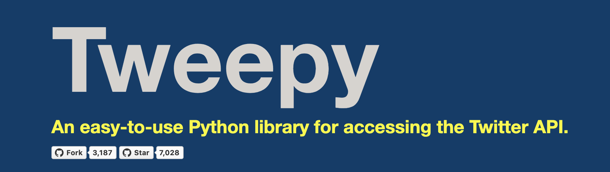
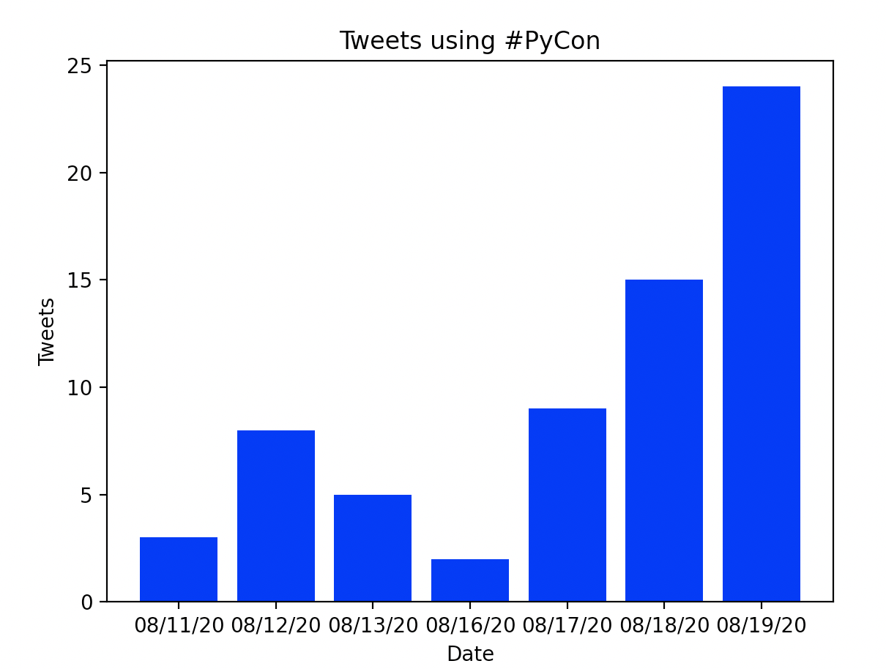

class: title

# Python 201:
## Taking It to the Next Level


???

Who am I? 

The ads say I'm speaking, because it's easier than saying PyRVA is speaking.

---


# What is PyRVA?

* Richmond's largest Python user group

--

* Nearly 1,500 members

--

* Almost 5 years old

--

* Lecture meetings the 2nd Wednesday each month

--

* Coding nights the 4th Thursday each month

--

* Beginner friendly

???

Several volunteers. Four of us will present today.

---

class: logo

# Presenters:

| | |
|---|---|
|  | Chris May |
|  | Mike Alfare |
|  | Stephen Lowery |
|  | Brian Cohan |

---

# Python is a unique language
--

* Python has simple syntax
???

write more than read

elementary school 
--

* Python has a powerful ecosystem
???

NASA, Instagram, Wall Street
--

* This combination contributes to python's popularity

???

Python is not as fast as C. Yet beat out C developers in creating an online platform (YouTube).

Not same environments JS. 
People are bringing it to the browser 

Too big to fit embedded chips.
it's getting put on development boards (Circuit Playground Express).

---

class: title

> Python is not the best language at doing any one thing. 
> But the moment you want to do more than one thing, Python quickly rises to the top.

<cite>~ Glyph Lefkowitz</cite>


---

# We're going to show you how to accomplish several different tasks, all from within python

--
* Use Podium to produce these slides

--
* Get data from Twitter

--
* Produce a simple bar chart

--
* Use Streamlit to produce charts and graphics

---

class: title


# [Podium](https://beeware.org/project/projects/applications/podium/)

### A markup-based slide presentation tool
### part of the BeeWare project

???

Before we get to all the fun data processing and visualizations, I'd like to take a moment
to look at this slide deck itself.
 
It was actually produced using python, with a tool called Podium.
 
Podium is a markup-based slide presentation tool that is part of the BeeWare project.

For those of you who are not familiar with the BeeWare project...

---
class: title
.left-column[

# [BeeWare](https://beeware.org/project/overview/)
]
.right-column[

* Enable Python to run on different devices
* Package a Python project so it can run on those devices
* Access the native widgets and capabilities of devices
* Help develop, debug, analyze, and deploy these projects
]

???

The BeeWare project has a mission to support python development in all environments.
They want python to run on multiple devices, not only on various operating systems, but
also on phones and tablets.

This means packaging python so that it can run on all of these devices, creating tools to
access native capabilities on these devices, and helping developers debug, analyze, and deploy
on these devices.

So what does it take to produce a slide using Podium? Let's take a look behind the scenes at
this slide right here...

---

## Create a Slide Using Augmented Markdown

``` markdown
---
class: title
.left-column[

# [BeeWare](https://beeware.org/project/overview/)
]
.right-column[

* Enable Python to run on different devices
* Package a Python project so it can run on those devices
* Access the native widgets and capabilities of devices
* Help develop, debug, analyze, and deploy these projects
]
---
```

???

This is the markdown behind the slide we were just on.
 
You'll see some more familiar markdown where images are linked to, links are embedded,
and bullet points are used.

But you'll also see tags that Podium picks up on, such as the .left-column, class: title,
and the --- slide separator.

So how do I use Podium?...

---

## Install Podium

1. Download the binary from the GitHub Releases page:
    https://github.com/beeware/podium/releases
1. On Linux, mark the AppImage file as executable:
    ```
    chmod +x Podium-*.AppImage
    ```
1. Place your markdown file inside of directory with a .podium extension:
    ```
    repo/slides.podium/slides.md
    ```
1. Execute Podium and select the .podium directory created above

???

Just read the slide, indicate that we're on a Linux machine.

Now let's take a quick look at the UI... 

---

## Explore the UI

You get a few options in the menu bar, all with hotkeys

* Open a new deck
* Reload the current deck
* Present the current deck in fullscreen 

???

Walk through the UI with the bullets

---

## Explore the UI

You also get additional functions on a second screen for the presenter

* Current and next slides
* Presenter notes
* Timer

???

Just read the slide

---

## What made this possible?

???

Let's look at the main controller class behind the Podium app.

--
```python
class Podium (toga.DocumentApp):
    ...
    def startup (self):
        ...
        self.commands.add(
            toga.Command(
                self.reload,
                label='Reload slide deck',
                shortcut=toga.Key.MOD_1 + 'r',
                group=toga.Group.FILE,
                section=1
            )
        )
```

???

You can see how those menu items were easily added to the Podium toolbar. 

Loosely walk through the arguments.

And let's take a look at the main method inside the UI class...

---

## What made this possible?

```python
class PrimarySlideWindow (toga.MainWindow):
    ...
    def create (self):
        self.html_view = toga.WebView(
            style=toga.style.Pack(
                flex=1,
                width=984 if self.deck.aspect == '16:9' else 738,
                height=576
            ),
            on_key_down=self.deck.on_key_press
        )
        self.content = self.html_view
    ...
```

???

Loosely walk through the arguments.

You can see how it doesn't take a lot to build Podium. It almost blurs the line
between writing code and writing configuration.

You may be surprised that Podium is less than 500 lines of python code. Obviously
there is some css and html in the codebase to handle some of the formatting, but
the orchestration code itself is quite small.

You may have picked up on how BeeWare accomplished this. Podium makes heavy use
of Toga, which is another BeeWare library.

---

## Podium is a Great Example of Modular Python Design

.left-column[

## [Briefcase](https://beeware.org/project/projects/tools/briefcase/)
### Convert a Python project into a stand alone native application
]
.right-column[

## [Toga](https://beeware.org/project/projects/libraries/toga/)
### A Python native, OS native GUI toolkit
]

???

Title

It uses two other BeeWare tools to accomplish its goal.

It uses Briefcase to run as an executable.
And it uses Toga to create a UI and present the slides.

All of the generic functionality is tucked away in these applications,
including device specific components.

That makes Podium very straight-forward application.

Now that we've covered how you're seeing what you're seeing,
let's get on with the data processing.

---

# Building a bar chart with...


### Visualization with Python

---

class: class

# Save Twitter data (by hand)

Say we wanted to use python to visualize how many tweets a day are using the #PyCon hashtag.

We can visit twitter and copy all the tweets we find, along with the day they were tweeted and save to a file that looks like this:

```
2020-05-09,Wow #PyCon is super cool!
2020-05-09,Wow #PyCon is super duper cool!
2020-05-10,Wow #PyCon is super awesome!
```

This type of file is known as a csv (or comma-separated values) file, and python comes with a library for working with them: `csv`

---

class: title

# Read Twitter data from a file

Now that we have some data, let's pull it into python using `csv`:

``` python
import csv
from pathlib import Path

def get_data():
    """ get the data from csv """
    # Find tweets in file next to this one
    base_path = Path(__file__)
    data_path = base_path.parent / "tweets.csv"
    # Open file & read content
    with data_path.open() as f:
        reader = csv.DictReader(f, ["date", "tweet"])
        lines = [line for line in reader]
    return lines
```

---

class: title

# Use Python to analyze Tweets

Now that we're able to read in our csv, let's count how many tweets we're getting per day:

``` python
def process_data(data):
    labels = list(set(row["date"] for row in data))
    labels.sort()
    values = []
    for label in labels:
        count = sum(1 for row in data if row["date"] == label)
        values.append(count)
    return labels, values

```

---

class: title

# Graph our Tweet Data

We can use a python library called `matplotlib` to create a simple bar chart:

``` python
import matplotlib.pyplot as plt

def draw_barchart(labels, values):
    plt.bar(labels, values, color="blue")
    plt.xlabel("Date")
    plt.ylabel("Tweets")
    plt.title("Tweets using #PyCon")
    plt.show()
```

---

class: screenshot

# ...and here is our chart!


---

class: title

# Scaling up- getting data automatically

Fetching a tweets for a small hashtag over a short period of time is pretty straightforward, but doesn't scale well.

Let's automate our data collection with another python library:



---

class: title

# Authenticating with Twitter's API

Twitter doesn't give it's data out- you have to set up an account with them and prove requests are from you. `tweepy` makes this easy:

``` python
def get_auth():
    auth = tweepy.OAuthHandler(
        TWITTER_API_KEY,
        TWITTER_API_SECRET_KEY,
        TWITTER_API_CALLBACK_URL,
    )
    auth.set_access_token(
        TWITTER_API_ACCESS_KEY, 
        TWITTER_API_ACCESS_SECRET
    )
    return auth
```
---

class: title

# Getting to the Tweets

Now that Twitter's API trusts us, we can ask it for data by using the `search` method:

``` python
def get_tweets(query, start_date=None):
    payload = {'q': query}
    if start_date:
        payload['since'] = start_date
    tweet_cursor = tweepy.Cursor(
        twitter_api.search, tweet_mode="extended", **payload
    )
    tweets = list(chain.from_iterable(tweet_cursor.pages()))
    return tweets
```

---

# Putting it all together

Now that we just need to update our chart's data function:

``` python
def get_data():
    """ Get Tweet data from Twitter """
    tweets = get_tweets('#PyCon', start_date='2020-07-01')
    rows = [
        {'date': tweet.created_at, 'tweet':tweet.full_text} 
        for tweet in tweets
    ]
    return rows
```

---

class: screenshot

# ...and here's the chart (automatically generated!)



---
class: title


# [Streamlit](https://www.streamlit.io/)

Open-source app framework for creating beautiful, performant apps in pure Python

On June 16, 2020, Streamlit announced a [$21M Series A Investment](https://medium.com/streamlit/announcing-streamlits-21m-series-a-ae05daa6c885)

---

# Streamlit in a Nutshell

Streamlit will run your app from top to bottom like a python script

Work with any Python libraries you'd like

Easily add interactive widgets using only Python

Use `@st.cache` decorator to cache expensive functions

Easily deploy to [Streamlit for Teams](https://www.streamlit.io/for-teams) (beta) or providers like [Heroku](https://pyrva-rvatech.herokuapp.com/)

---

# Graph PyRVA Attendance History - Code

``` python
import altair, pandas, requests, streamlit

url = 'https://api.meetup.com/PyRVAUserGroup/events'
response = requests.get(url, params={'status': 'past'})
df = pandas.DataFrame(response.json())

streamlit.write(df)
streamlit.altair_chart(
    altair.Chart(df).mark_line().encode(
        x=altair.X('local_date:T', title='Date'),
        y=altair.Y('yes_rsvp_count:Q', title='RSVPs'),
    ),
    use_container_width=True
)
```

---

# Graph PyRVA Attendance History - Results

`streamlit run src/pyrva_talk/streamlit/pyrva-attendance.py`


---

# Streamlit Works Well With The Following and More!

.left-column[

**Data Analysis / ML**

* Numpy
* Pandas
* Keras
* TensorFlow
* Scikit Learn
* OpenCV
]
.right-column[

**Visualization**

* Altair
* Bokeh
* matplotlib
* Seaborn
* Deck.GL
* Plotly
]

---

# Interactive Widgets!

.left-column[

]
.right-column[

]

---

# Streamlit Caching

.left-column[
<br><br><br>
``` python
def bar(y):
  time.sleep(1)
  return y

@st.cache
def foo(x):
  time.sleep(1)
  return bar(x)

foo(1)
```
]
.right-column[

Streamlit will check:

* The input parameters that you called the function with
* The value of any external variable used in the function
* The body of the function
* The body of any function used inside the cached function 
]

---

# Deploy
```
web: sh setup.sh && streamlit run path/to/app.py
```

.left-column[

To deploy to Heroku, you need three files:

* Your application 
  * May be multiple files
* `Procfile` (above)
* `setup.sh` (right)

]
.right-column[
```
mkdir -p ~/.streamlit/

echo "[general]\nemail = author@example.com" > ~/.streamlit/credentials.toml

echo "[server]\nheadless = true\nenableCORS=false\nport = $PORT\n" > ~/.streamlit/config.toml
```
]

---

# Resources:

* PyRVA: https://www.pyrva.org/
* GitHub: https://www.github.com/pyrva/rvatech-presentation/
* Streamlit app: https://pyrva-rvatech.herokuapp.com/
* Noteable python packages:
    * streamlit, altair
    * tweepy, requests
    * pandas, matplotlib
    * toga
